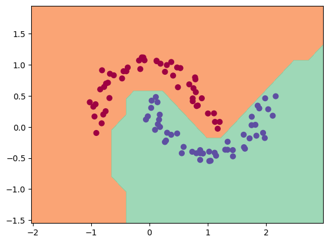

# tinygrad
A tiny scalar-valued autograd engine.

Implemented features:
* reverse-mode autodiff over a dynamically built DAG
* a small library on top of it with a Pytorch-like API, which support many simplified but similar stuffs such as auto parameter registration of attributes.

The framework operate on a scalar level. while it is super slow, it has essential elements to build up entire dnn for binary classification, as shown in the demo notebook.

## Example Usage

```python
from tinygrad.engine import Value


a = Value(2.0)
b = Value(-3.0)


c = a + b
d = a * b + b**2
e = d.relu() + c


print(f"c: {c}")
print(f"d: {d}")
print(f"e: {e}")


e.backward()


print(f"a.grad: {a.grad}")
print(f"b.grad: {b.grad}")
```

## Training a neural net
The notebook `demo.ipynb` offers a demonstration of training a 2-layer neural network (MLP) for binary classification. It involves initializing a neural network from the `tinygrad.nn` module, implementing a simple SVM "max-margin" binary classification loss, and using SGD for optimization. As illustrated in the notebook, a 2-layer neural network with two 16-node hidden layers produces the following decision boundary on the moon dataset:


## Running tests
Simple unittests are offered under tests directory, including trivial tests and diff tests with pytorch. To run tests:
```shell
python -m pytest
```